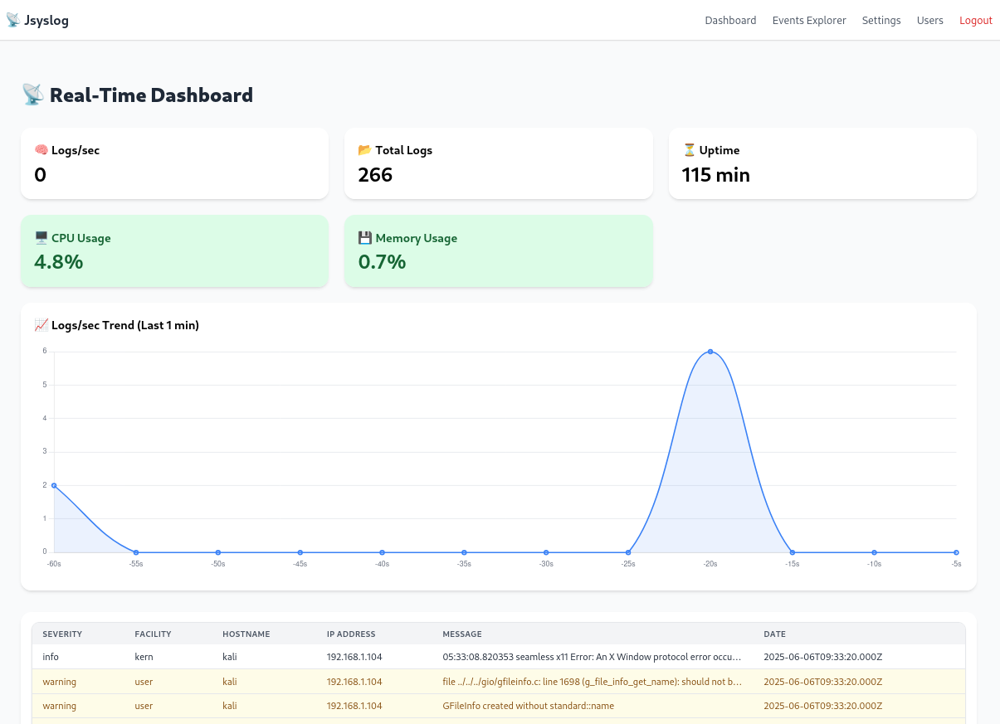
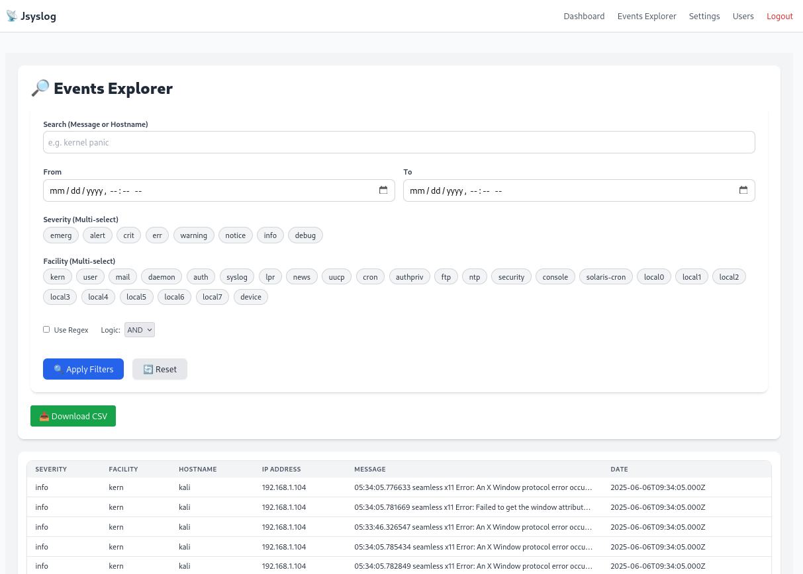
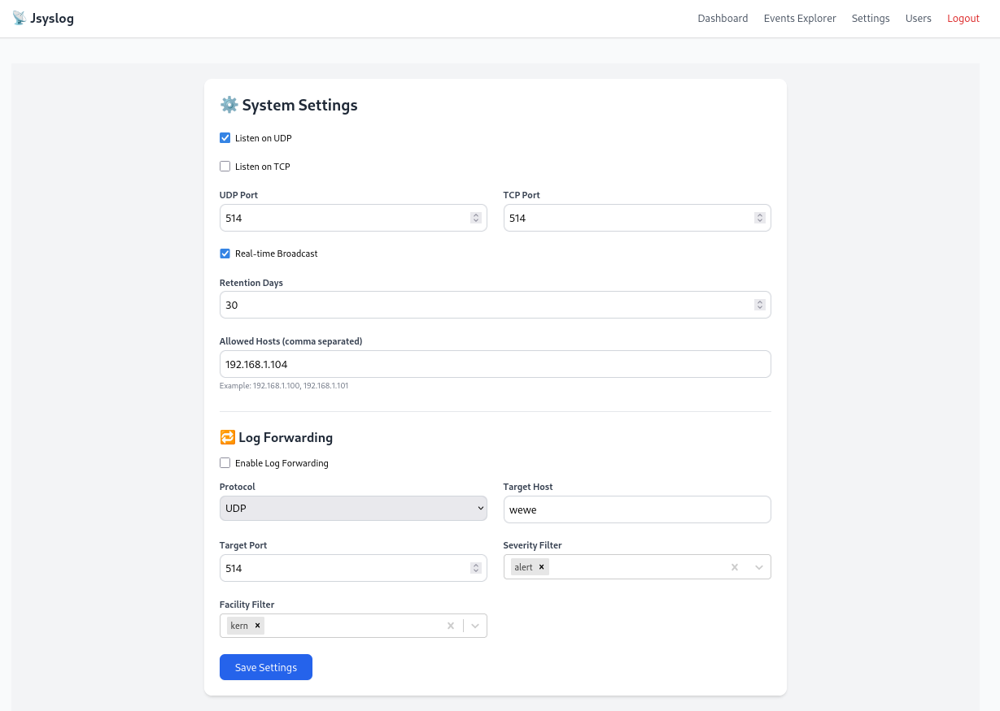
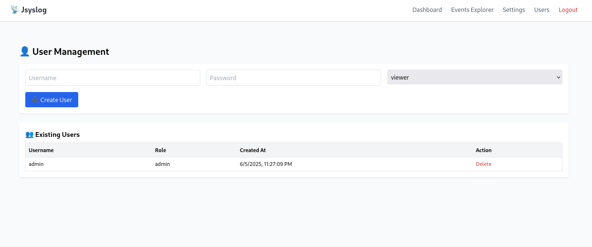

# 📡 jsyslogd - Real-Time Syslog Dashboard

A modern, real-time syslog server with a beautiful React dashboard and PostgreSQL backend.

---

## 🚀 Features

* UDP & TCP syslog listener
* Live log dashboard with severity highlighting
* Filters, search, and CSV export
* Log retention and forwarding settings
* Role-based access (Admin, Operator, Viewer)

---

## 🧱 Prerequisites

* Node.js (v18+ recommended)
* PostgreSQL
* npm or yarn

---

## 🔧 Backend Setup

### ✅ For Linux (Ubuntu/Debian):

#### 1. Start PostgreSQL

```bash
sudo service postgresql start
```

#### 2. Create Database and User

```bash
sudo -u postgres psql
```

Inside PostgreSQL prompt:

```sql
CREATE DATABASE syslog;
CREATE USER syslog WITH PASSWORD 'syslogpass';
GRANT ALL PRIVILEGES ON DATABASE syslog TO syslog;
ALTER SCHEMA public OWNER TO syslog;
GRANT ALL ON SCHEMA public TO syslog;
GRANT ALL PRIVILEGES ON ALL TABLES IN SCHEMA public TO syslog;
```

Alternatively, you can use the provided `init.sql` script:

```bash
psql -U postgres -f init.sql
```

Make sure the script contains:

```sql
CREATE DATABASE syslog;
\c syslog;
CREATE USER syslog WITH PASSWORD 'syslogpass';
GRANT ALL PRIVILEGES ON DATABASE syslog TO syslog;
ALTER SCHEMA public OWNER TO syslog;
GRANT ALL ON SCHEMA public TO syslog;
GRANT ALL PRIVILEGES ON ALL TABLES IN SCHEMA public TO syslog;
```

### ✅ For Windows (using pgAdmin or terminal):

#### Option 1: Manually in pgAdmin

Use the Query Tool:

```sql
CREATE DATABASE syslog;
CREATE USER syslog WITH PASSWORD 'syslogpass';
GRANT ALL PRIVILEGES ON DATABASE syslog TO syslog;
ALTER SCHEMA public OWNER TO syslog;
GRANT ALL ON SCHEMA public TO syslog;
GRANT ALL PRIVILEGES ON ALL TABLES IN SCHEMA public TO syslog;
```

#### Option 2: Using `init.sql` in Command Prompt

Ensure `psql` is in your system PATH and run:

```bash
psql -U postgres -h localhost -f init.sql
```

Contents of `init.sql`:

```sql
CREATE DATABASE syslog;
\c syslog;
CREATE USER syslog WITH PASSWORD 'syslogpass';
GRANT ALL PRIVILEGES ON DATABASE syslog TO syslog;
ALTER SCHEMA public OWNER TO syslog;
GRANT ALL ON SCHEMA public TO syslog;
GRANT ALL PRIVILEGES ON ALL TABLES IN SCHEMA public TO syslog;
```

### 3. Create `.env` file for backend

Inside `backend/.env`:

```env
PGUSER=syslog
PGPASSWORD=syslogpass
PGHOST=localhost
PGDATABASE=syslog
PGPORT=5432

JWT_SECRET=supersecret
PORT=8000

CORS_ORIGIN=http://localhost:3000
```

### 4. Install backend dependencies

```bash
cd backend
npm install
```

### 5. Run backend server

```bash
npm run dev
```

---

## 🌐 Frontend Setup

### 1. Create `.env` file for frontend

Inside `frontend/.env`:

```env
REACT_APP_API_BASE=http://localhost:8000
```

### 2. Install frontend dependencies

```bash
cd frontend
npm install
```

### 3. Run frontend

```bash
npm start
```

---

### Dashboard View


### Events Explorer


### Settings


### Users


## ✅ Access the App

* Dashboard: [http://localhost:3000](http://localhost:3000)
* API: [http://localhost:8000](http://localhost:8000)

---

## 🤝 Contributing

Pull requests are welcome. Let's make open-source syslog better!

---

## 📄 License

MIT License
